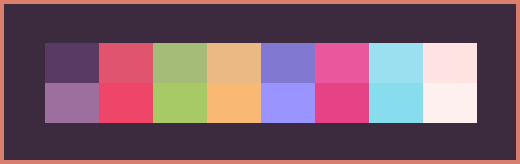
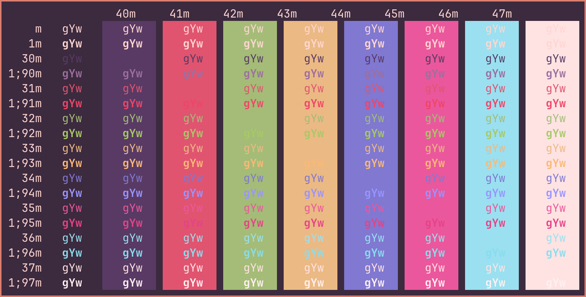

# Velvet Mango Ghostty
The Velvet Mango color scheme for Ghostty.

 

* [Ghostty for macOS and Linux](https://ghostty.org/)

* [Velvet Mango for VS Code](https://github.com/miles-crighton/velvet-mango-vscode) 

Place file in ~/.config/ghostty/themes/ (create folders if non-existing).

*Velvet Mango*

 

